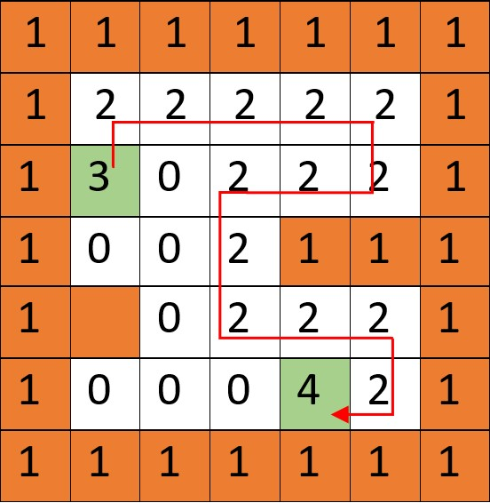

# Motion planning algorithm
Given the start and goal points, this project aims to find the goal point in a 2D matrix. To do so, we will transform the given BFS code into something more greedy. 

The greedy algorithms implemented are:
- **DFS:** The priority order is up, right, down, left. This means that starting on the start point we will go upwards if possible, if it is not possible then we turn right, if it is not possible then we go down and if it is not possible then we turn left. In the case that we can’t go to any of those places because they are walls, obstacles or visited nodes, we will keep going to the previous node until we find a node where we can choose a new direction.
- **Bug 2:** This algorithm heads toward the goal on a line. However, diagonal movements have not been implemented so what you will see is a zig-zag movement. To achieve this, we calculate the distances from the up, down, right and left cell to the goal point. Later, we move to the cell which is closer to the goal. If there is an obstacle or wall then we won't consider that cell and we will move to the next closer free cell.

**General notation**

Example shown below.
* 0 = free space
* 1 = ocupued (wall/obstacle)
* 2 = visited point
* 3 = start point
* 4 = goal point

# 1. Extras

**IMPORTANT:** inside ``src/python/algorithms`` you can find dfs_extras and bug2_extras, which are the algorithms with these extras implemented. Additionally, you will see a folder called ``2_dfs_minimum_requirements`` which contains the algorithm with the minimum requirements for passing this project. Open it JUST IN THE CASE that the ``main.py`` of the *extras* folders don't work properly for any reason. 
- Extra 1: Two greedy algorithms implement, DFS with backtracking and Bug 2.
- Extra 2: More information showed in the output. 
- Extra X: Also, a colored map is shown by using ANSI escape codes.
- Extra 3: Asking which map you would like to test. Check that the answer is a valid map.
- Extra 4: Asking for the start and goal points. If you type an incorrect number or a letter, the program will tell you what numbers you can choose.
- Extra 5: A new map was created. The map is called map12 and it is a lethal map full of obstacles. You can see it in the mapX folder.
- Extra 6: Time study in ``src/python/algorithms/Time_Analysis.ipynb``. It was performed in equal conditions for the 3 algorithms, this means with no extra functions implemented so none of them took extra time executing those functions.
- Extra X: YouTube video.
- Extra 7: Functions in a separate file to make the code cleaner.
- Extra 8: The code works  and is tested for every map.
- Extra 9: Github repository with commit history.

## 2. Project Structure:
- **src/python/algorithms**: contains the BFS algorithm and the greedy algorithms that have been implemented. 

- **maps**: each map contains a `map.csv` with the matrix, a ``map.png ``with a picture of the map and a ``README.md`` that specifies the suggested start and goal points.

- **src/python/algorithms/AlgorithmsNotebook**: jupyter notebook that contains the trials that I have done during the development of the project:

## 3. Output:
After selecting the map and the start and finish coordinates you will see the initial configuration that you just chose. Then you'll find the iterations. At the end of the output, you will see the found path, the time of execution and the number of visited nodes.

## References:
* [Proffesor repository.](https://github.com/jgvictores/master-ipr)
* [Youtube video explaining DFS algorithm.](https://www.youtube.com/watch?v=W9F8fDQj7Ok)
