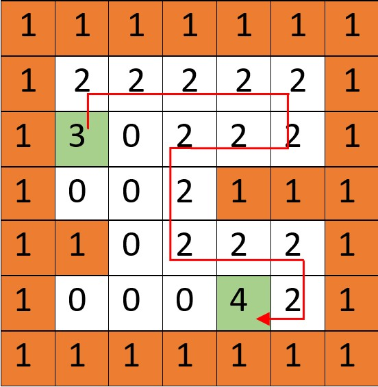

# Motion planning algorithm
Given the start and goal points, this project aims to find the goal point in a 2D matrix. To do so, we will transform the given BFS code into something more greedy. 

The greedy algorithm implemented here is a DFS algorithm. The priority order is up, right, down, left. This means that starting on the start point we will go upwards if possible, if it is not possible then we turn right, if it is not possible then we go down and if it is not possible then we turn left. In the case that we can’t go to any of those places because they are walls, obstacles or visited nodes, we will go to the previous node until we find a node where we can keep going in a new direction.

**General notation**
Example shown below.
* 0 = free space
* 1 = ocupued (wall/obstacle)
* 2 = visited point
* 3 = start point
* 4 = goal point

# Extras
**1.** Github 
- The code works for every map.
- Github repository with commit history.
- Functions in a separate folder.

## Output:
At the beggining of the output you will find the initial configuration followed by the iterations and finally the found path, time of execution and the number of nodes visited.

## Project Structure:
- **src/python/algorithms**: contains the BFS algorithm and the Greedy algorithms that have been implemented.
- **maps**: each map contains a `map.csv` with the matrix, a ``map.png ``with a picture of the map and a ``README.md`` that specifies the start and goal point.
- **src/python/algorithms/AlgorithmsNotebook**: jupyter notebook that contains the trials that I have done during the development of the project:

## Considerations:
### C1
blabla
### C2
blabla

## References:
* [Proffesor repository.](https://github.com/jgvictores/master-ipr)
* [Youtube video explaining DFS method.](https://www.youtube.com/watch?v=W9F8fDQj7Ok)
